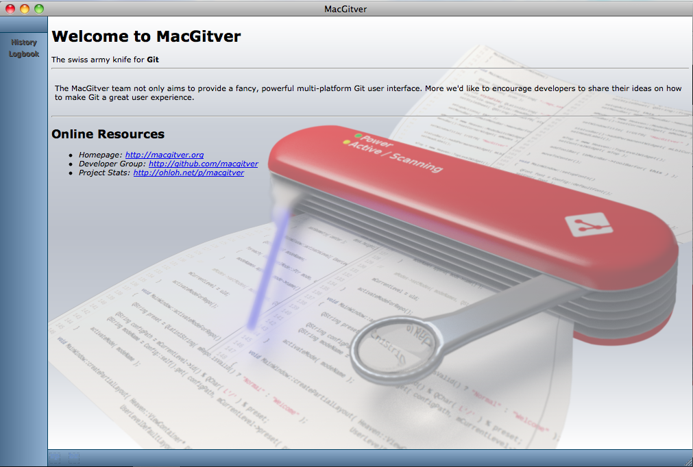
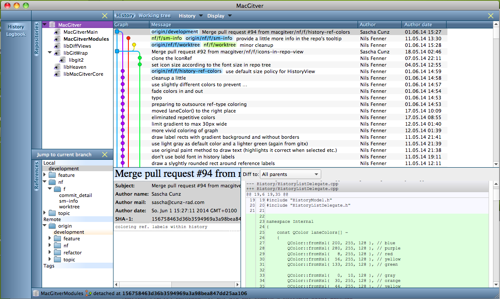
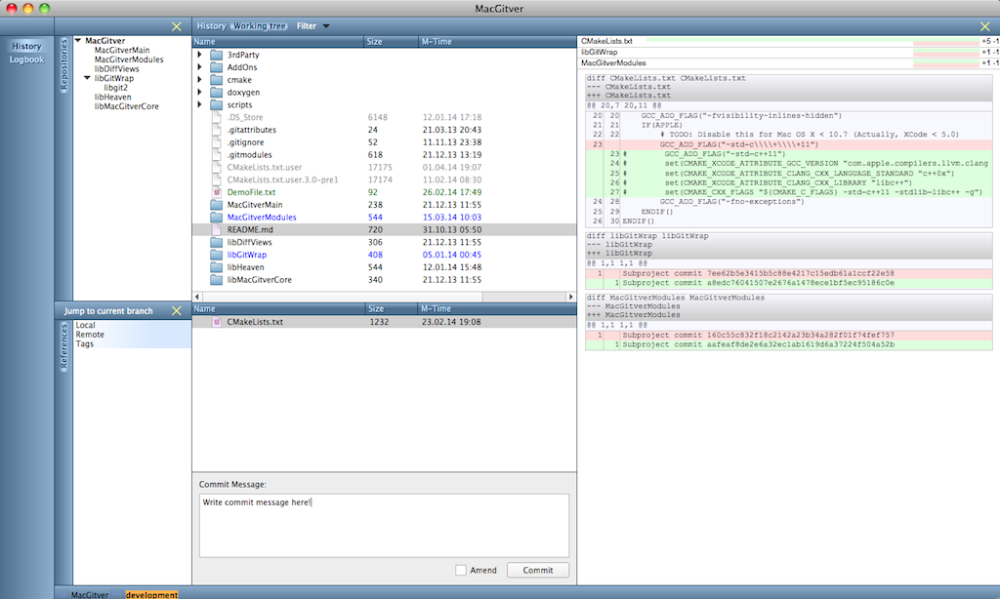
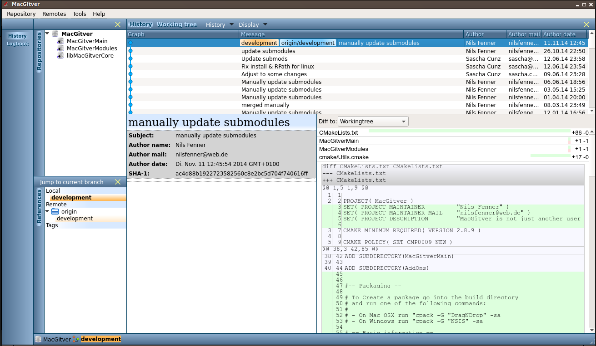

# Welcome to the MacGitver Website
Here you will find all online resources available for the MacGitver project in one place.

# Get a glimpse
To see what's about to be created here, we provide some screenshots.

Say hello to MacGitver:

The *history view* shows an overview about your repositories and their history:

This is, how your working directory appears in MacGitver:

This one is for the Lubuntu people among us:

